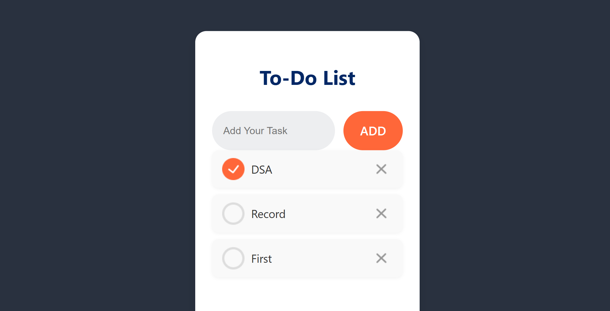

# React To-Do List

A clean and simple to-do list application built with React. This project allows you to add, track, and manage your daily tasks.

## Features

* **Add Tasks:** Quickly add new tasks to your list.
* **Complete Tasks:** Mark tasks as complete with a single click.
* **Delete Tasks:** Remove tasks you no longer need.
* **Clean UI:** A modern and intuitive user interface for a seamless experience.

## Getting Started

To get a local copy up and running, follow these simple steps.

### Prerequisites

You need to have Node.js and npm installed on your machine.

* [Node.js](https://nodejs.org/)
* npm (comes with Node.js)

### Installation

## Built With

* [React](https://reactjs.org/) - The web framework used.
